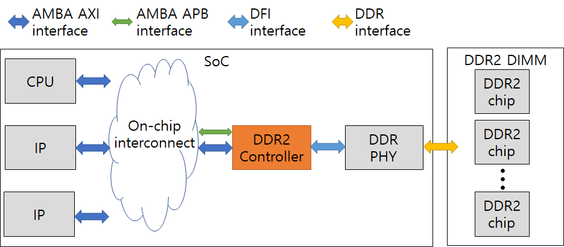
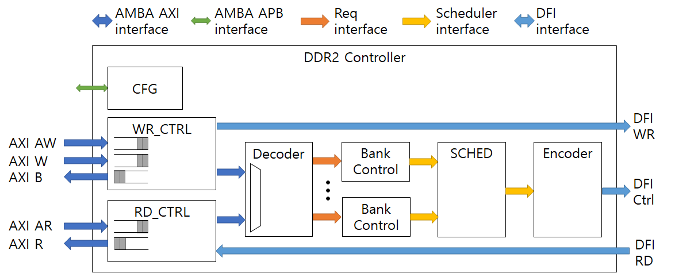

# DDR2 Controller Project

## Objective

The goal of this project is to develop a DDR2 controller to understand DRAM operations and improve hardware design skills.
It uses SystemVerilog language to implement a DDR2 (or its successor) controller.

## Overview

The controller has AMBA APB and AXI interfaces to the on-chip interconnect.
The APB interface is used to configure the controller (e.g., setting a timing parameters) and check status (e.g., reading a debugging register).
The controller receives DRAM access requests via the AXI interface, schedules, converts into DRAM commands, and forwards to the DDRPHY.
The DDRPHY fine-controls the signals to meet the tight sub-cycle DRAM timing parameters.

## Block Diagram

## Protocols

This project utilizes industry standard protocols.

### AMBA AXI/APB

### DFI
This is an industry-standard for communication between DDR controller and DDR PHY.
Note that this project utilizes a simplified version of the protocol and has an old version of the standard under DOC folder.

### DDR2

For a complete specification, refer to JEDEC DDR2 standard (JESD79-2F).

For a condense documentation, refer to the Micron datasheet (in DOC folder)

## SystemVerilog Interface

This design heavily utilizes "interface" in SystemVerilog to simplify the connections and ease verification.
Some features of the interface are not synthesizeable and we added "synthesis translate_off" and "synthesis translate_on" for such features.

## DRAM Timing Parameters
### Inter-bank Timing

### Intra-bank Timing
